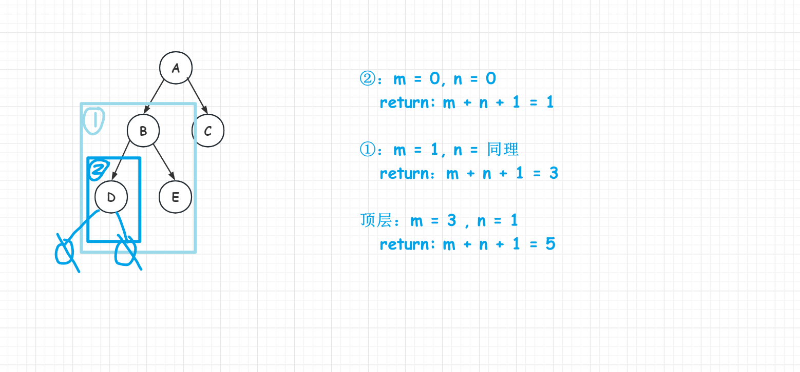

## Tree

### 图解🧩

[中序遍历非递归图解](https://github.com/Agility6/data-structure-c/blob/e23e9497485e10fb6ca18351960ff33aebe41a31/Tree/tree-traversal.cpp#L87)

[求二叉树的结点数](https://github.com/Agility6/data-structure-c/blob/2c9e5dd2cba6967fdc343a7c2f402c3e14f38e82/Tree/application-tree.cpp#L94)
